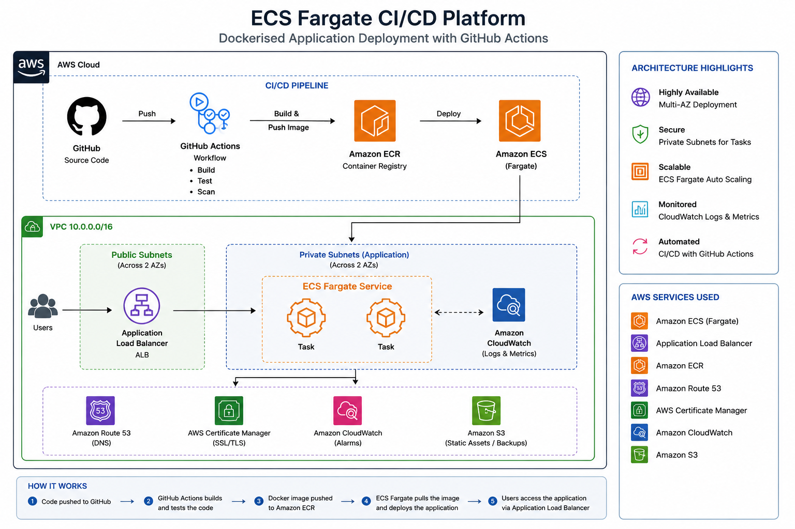

# ECS Fargate CI/CD Platform

## Architecture Diagram



## Overview

This project demonstrates how to containerise a web application using Docker, store container images in Amazon ECR, deploy containers to Amazon ECS Fargate, and automate deployments using GitHub Actions.

## Architecture

```text
GitHub
   ↓
GitHub Actions
   ↓
Docker Build
   ↓
Amazon ECR
   ↓
Amazon ECS Fargate
   ↓
Running Container
```

## Services Used

- Docker
- Amazon ECR
- Amazon ECS Fargate
- GitHub Actions
- IAM
- AWS CLI

## What This Project Demonstrates

This project demonstrates the ability to build, package, store, deploy and automate containerised applications on AWS.

Key capabilities demonstrated include:

- Creating and managing Docker images
- Writing and using Dockerfiles
- Running containers locally
- Creating and managing Amazon ECR repositories
- Authenticating Docker with ECR
- Pushing Docker images to ECR
- Creating ECS Fargate services
- Deploying containers to ECS
- Automating deployments with GitHub Actions
- Implementing CI/CD workflows

## Project Structure

```text
docker-app/
├── Dockerfile
└── index.html

.github/
└── workflows/
    └── deploy-ecs.yml
```

## Key Learning Outcomes

Through this project, I gained hands-on experience with:

- Containerisation
- Docker image management
- Container registries
- ECS Fargate deployments
- CI/CD automation
- GitHub Actions
- Cloud-native application deployment

## Validation

The application was successfully containerised using Docker, pushed to Amazon ECR, deployed to ECS Fargate and made publicly accessible.

A GitHub Actions workflow was configured to automate image builds, image pushes to ECR and ECS service deployments following changes pushed to the repository.